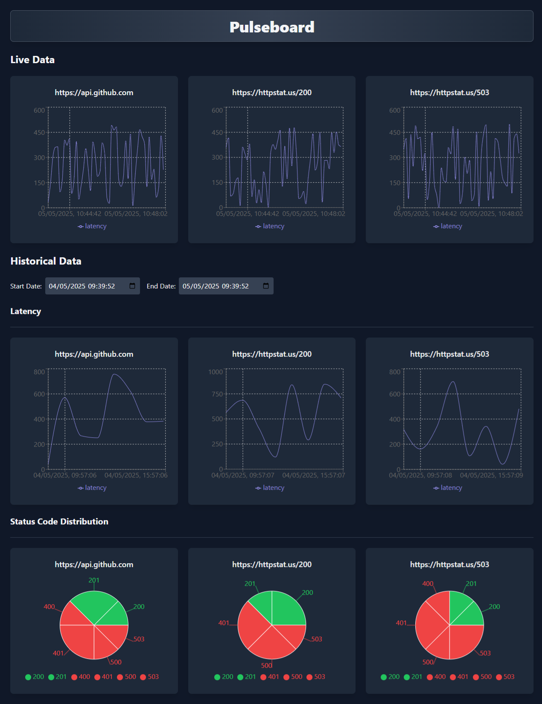

# Pulseboard - API Metrics Dashboard

Pulseboard is a full-stack application designed to monitor and visualize API performance metrics in real-time. It provides insights into API latency, status code distribution, and historical trends, making it a valuable tool for developers and DevOps teams.

## Features

- **Real-Time Monitoring**: Live data visualization using WebSockets.
- **Historical Metrics**: Fetch and display historical API performance data.
- **Interactive Charts**: Intuitive visualizations with `Recharts` for latency and status code distribution.
- **Backend API**: A Go-based backend with SQLite for data storage and RESTful endpoints.
- **Frontend**: A React-based dashboard styled with Tailwind CSS.
- **Test Data Generation**: Backend endpoint to generate mock data for testing and demonstration.
- **Configurable Poller**: The backend poller can be enabled or disabled using a `--run-poller` flag.

## Technologies Used

### Frontend
- **React**: For building the user interface.
- **Vite**: For fast development and build tooling.
- **Tailwind CSS**: For modern, responsive styling.
- **Recharts**: For interactive data visualizations.

### Backend
- **Go**: For a high-performance backend.
- **SQLite**: Lightweight database for storing metrics.
- **Gorilla WebSocket**: For real-time communication.
- **RESTful API**: For fetching historical data and generating test data.
- **Endpoints**:
  - `/getlatency`: Fetch historical latency metrics.
  - `/statuscodedistribution`: Fetch status code distribution metrics.
  - `/generatetestdata`: Generate mock data for testing and demonstration purposes.

## Architecture Overview

1. **Frontend**: The React-based dashboard connects to the backend via REST APIs and WebSockets to display real-time and historical metrics.
2. **Backend**: The Go server handles WebSocket connections, REST API requests, and database interactions.
3. **Database**: SQLite stores monitored endpoints and their metrics.

## Key Components

### Frontend
- **`App.jsx`**: The main dashboard component.
- **`useWebSocketMetrics.jsx`**: Custom React hook for handling WebSocket connections.
- **`LatencyChart.jsx`**: Line chart for visualizing latency over time.
- **`StatusCodePieChart.jsx`**: Pie chart for visualizing status code distribution.

### Backend
- **`websocket.go`**: Handles WebSocket connections and sends real-time metrics.
- **`poller.go`**: Periodically polls monitored endpoints and stores metrics in the database.
- **`handlers/latency.go`**: REST API endpoint for fetching historical latency metrics.
- **`handlers/statuscodedistribution.go`**: REST API endpoint for fetching status code distribution.

## How to Run the Project

### Prerequisites
- Node.js (for the frontend)
- Go (for the backend)
- SQLite (for the database)

### Frontend
1. Navigate to the `frontend` directory:
   ```bash
   cd frontend
   ```
2. Install dependencies:
   ```bash
   npm install
   ```
3. Start the development server:
   ```bash
   npm run dev
   ```

### Backend
1. Navigate to the `backend` directory:
   ```bash
   cd backend
   ```
2. Run the Go server:
   ```bash
   go run ./cmd/poller/main.go
   ```
3. To enable the poller, pass the `--run-poller` flag:
   ```bash
   go run ./cmd/poller/main.go --run-poller
   ```
4. Use the `/generatetestdata` endpoint to populate the database with mock data:
   ```bash
   curl http://localhost:8080/generatetestdata
   ```

The frontend will be available at `http://localhost:5173`, and the backend API will run on `http://localhost:8080`.

## Demo


